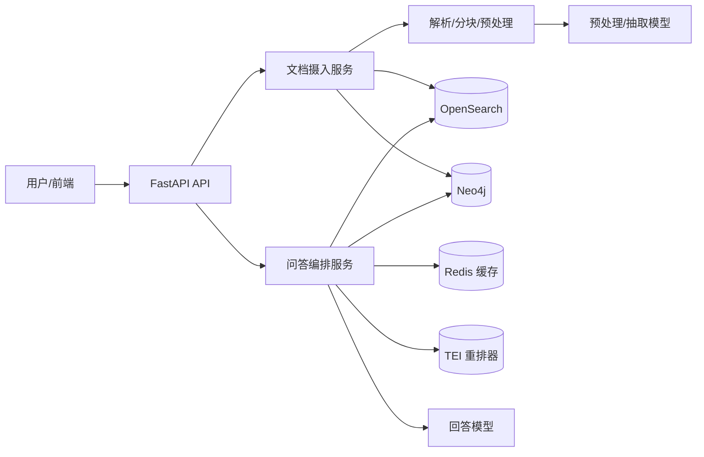
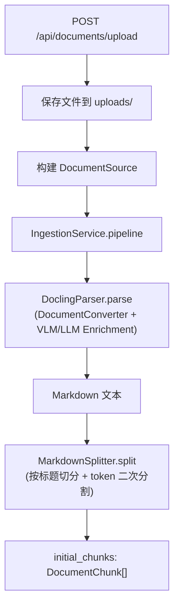
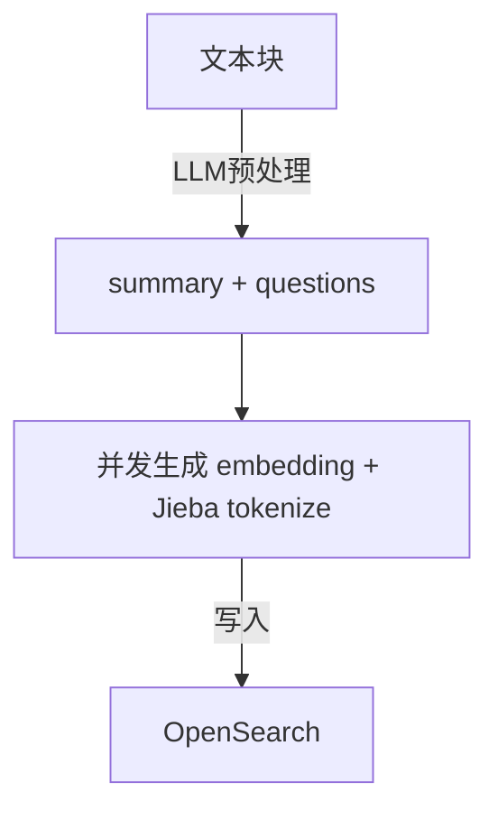
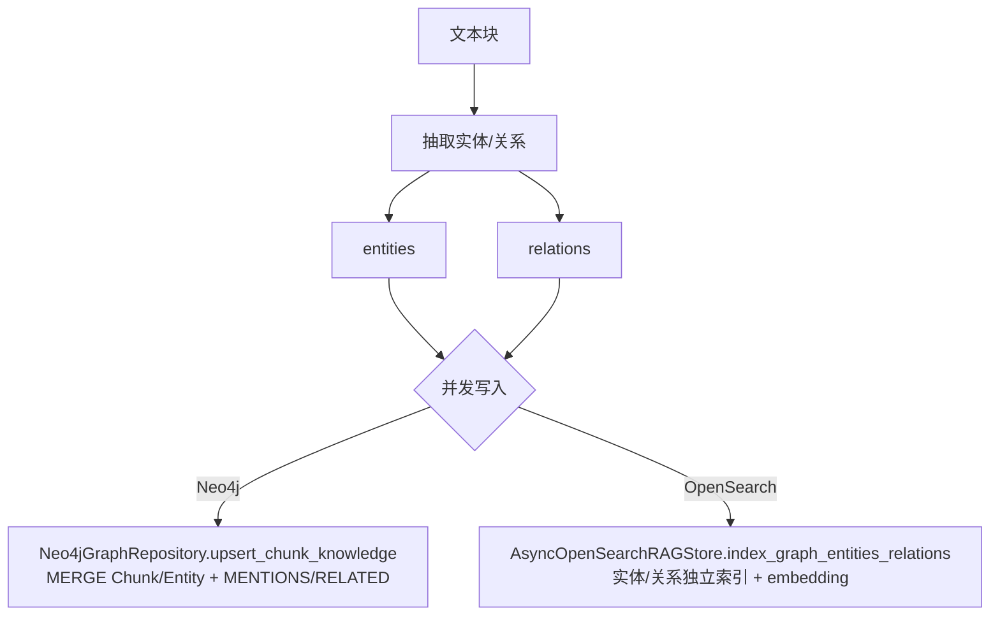
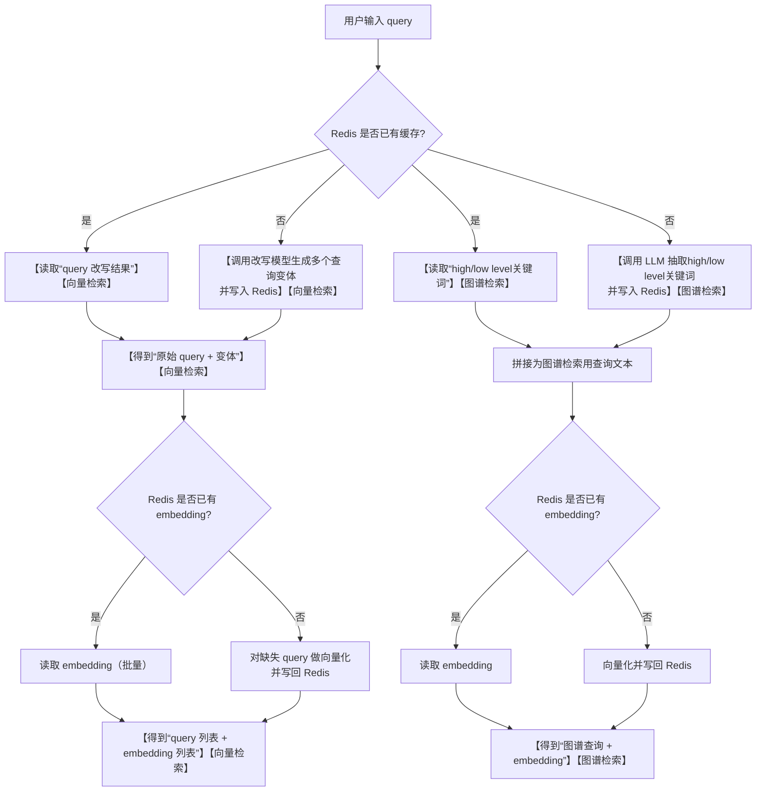
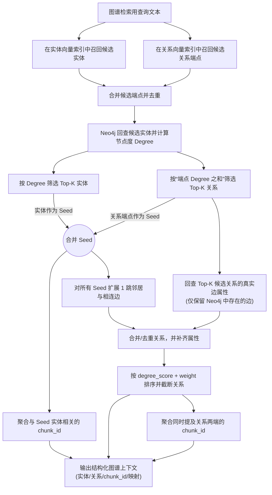
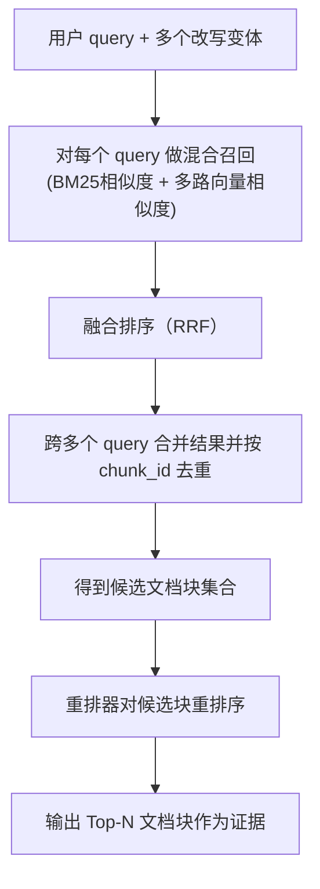
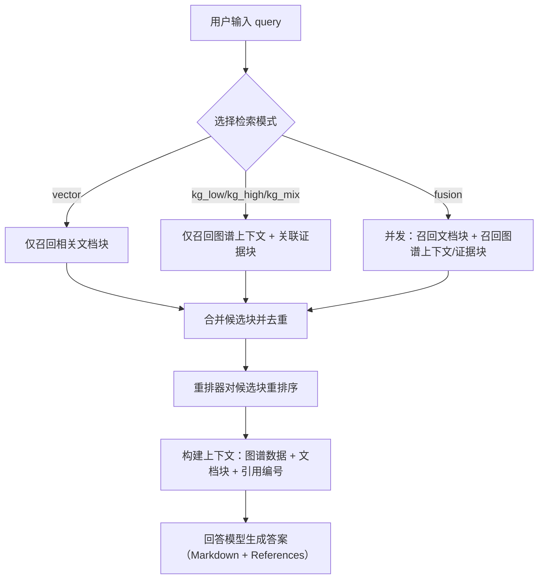

# 项目功能

- 文档摄入：上传 PDF/DOCX → Docling 解析（可选公式/图片/表格增强）→ Markdown → 分块 → LLM 预处理（摘要/假设性问题）
- 索引与存储：
  - OpenSearch：chunk 混合检索索引（BM25 + 多路向量 + RRF）、实体向量索引、关系向量索引
  - Neo4j：知识图谱（Chunk/Entity/MENTIONS/RELATED），支持增量更新（关系 `weight` 累积）
- 问答：支持 `vector/kg_low/kg_high/kg_mix/fusion` 多检索模式；并发检索（向量 + 图谱）→ 融合候选 →（可选）TEI 重排 → LLM 生成带引用的回答
- 缓存：Redis 缓存 query 改写、关键词抽取结果、embedding（TTL 可配置）
- API：FastAPI 提供上传摄入、问答、图谱子图查询等接口

# 项目架构

采用分层架构（`backend/`）：

- `api/`：FastAPI 入口与接口 schema
- `services/`：业务编排（摄入/问答）
- `domain/`：核心模型与抽象接口（Repository/Service）
- `infrastructure/`：外部依赖实现（Docling、OpenSearch、Neo4j、Redis、LLM/Reranker）
- `core/`：配置、提示词、日志等横切能力

外部依赖（默认 `docker compose`）：

- OpenSearch 3.x（9200）+ Dashboards（5601）
- Neo4j 5.x（7474/7687）
- Redis 7（6379）
- TEI Reranker（8082，可选；不可用时会自动降级为“不重排”）



# 核心流程

## 1) 文本引接、读取、解析、分块

对应入口：`POST /api/documents/upload` → `backend/api/server.py`。

流程说明：

1. API 接收上传文件并保存到本地 `uploads/`；构建 `DocumentSource`（含 `document_id/document_name/file_path/metadata`）。
2. 调用 `IngestionService.pipeline()`（`backend/services/ingestion_service.py`）。
3. 解析：`DoclingParser.parse()`（`backend/infrastructure/parse/parser.py`）调用 Docling `DocumentConverter`，在 PDF/DOCX 场景下按配置启用 VLM/LLM 增强管道（公式/图片/表格/可选 OCR），输出 Markdown。
4. 分块：`MarkdownSplitter.split()`（`backend/infrastructure/parse/splitter.py`）先按 Markdown 标题结构切分，再对超长块按 token 阈值做二次递归切分，生成 `DocumentChunk[]`。



## 2) 文本块预处理，并存入 OpenSearch（Chunk 索引）

目标：为每个 `DocumentChunk` 生成“检索增强字段”，并批量写入 OpenSearch 的 chunk 索引。

流程说明：

1. `LLMPreprocessor.run_concurrent_preprocessing()`（`backend/infrastructure/parse/preprocessor.py`）并发调用 LLM，为每个 chunk 生成：
   - `summary`（摘要）
   - `hypothetical_questions`（假设性问题）
2. `IngestionService` 以流式方式接收 enriched chunk，按 `BATCH_SIZE` 分批写入：`store.bulk_add_documents()`（`backend/services/ingestion_service.py`）。
3. `AsyncOpenSearchRAGStore.bulk_add_documents()`（`backend/infrastructure/repository/opensearch_store.py`）内部并发生成：
   - 4 路向量：`embedding_content / embedding_parent_headings / embedding_summary / embedding_hypothetical_questions`
   - Jieba 分词字段：`content_tokenized`
   然后使用 `async_bulk` 批量写入并 `refresh`。



## 3) 抽取文档块中实体、关系，并存入 Neo4j（同时写入 OpenSearch 实体/关系索引）

目标：从每个 chunk 中抽取实体/关系并增量更新图谱；同时将实体/关系单独向量化写入 OpenSearch，供检索阶段回查。

流程说明：

1. `LLMGraphExtractor.extract()`（`backend/infrastructure/graph/llm_extractors.py`）调用 LLM，按 `KG_EXTRACT_PROMPT` 输出并解析为：
   - `entities: GraphEntity[]`（name/type/description）
   - `relations: GraphRelation[]`（source/target/keywords/description/weight）
2. Neo4j 增量更新：`Neo4jGraphRepository.upsert_chunk_knowledge()`（`backend/infrastructure/graph/neo4j_graph.py`）
   - `MERGE` Chunk/Entity 节点
   - 建立 `(:Chunk)-[:MENTIONS]->(:Entity)`
   - 建立/合并 `(:Entity)-[:RELATED]->(:Entity)`（按端点字典序规范化，避免重复边；weight 累加；keywords/description 合并）
3. OpenSearch 实体/关系索引：`AsyncOpenSearchRAGStore.index_graph_entities_relations()`（`backend/infrastructure/repository/opensearch_store.py`）
   - 实体写入格式：`entity_name、entity_type、entity_description`
   - 关系写入格式：`source_entity、target_entity、relationship_keywords、relationship_description`
   并分别写入 `entity_index_name` / `relation_index_name`（向量字段：`embedding_entity_text` / `embedding_relation_text`）。



## 4) 用户 Query 处理（改写/关键词抽取/向量化/Redis 缓存）

目标：对用户 query 做“检索增强”，并尽量复用 Redis 缓存，减少重复的 LLM/Embedding 计算。

主要行为：

- 查询改写（用于向量检索）：优先从 Redis 读取改写结果；未命中再调用改写模型生成多个查询变体，并写回 Redis。
- 高/低层关键词抽取（用于图谱检索，低层通常包含实体/术语）：优先从 Redis 读取抽取结果；未命中再调用 LLM 抽取，并写回 Redis。
- Query 向量化：优先从 Redis 读取 embedding；未命中再向量化并写回 Redis（带 TTL）。

缓存内容（Redis key 形态，便于排查与复用）：

- `qrew:{rewrite_model}:{sha256(query)}`：query 改写结果（JSON，含 `rewrites`）。
- `vecq:{rewrite_model}:{sha256(query)}`：向量检索阶段实际使用的 query 列表（JSON，含 `vector_queries`）。
- `kgkw:{research_model}:{sha256(query)}`：高/低层关键词抽取结果（JSON，含 `high`/`low`）。
- `emb:{embedding_model}:{sha256(text)}`：文本的 embedding 向量（JSON 数组）。

说明：以上 key 默认使用同一套 TTL（见 `REDIS_EMBEDDING_TTL_SECONDS`）。



## 5) 图谱检索：OpenSearch 候选 → Neo4j 回查 → degree 排序 → 邻居扩展

目标：先用向量库快速召回“可能相关的实体/关系”，再用 Neo4j 的真实图数据做校验、排序和扩展，最终输出结构化图谱上下文，并给出关联 chunk_id 以回查文本证据。

当前实现要点：

- 在 OpenSearch 的“实体索引/关系索引”中分别做向量检索，拿到候选实体名、候选关系端点（source/target）。
- 将候选端点合并去重后，在 Neo4j 中回查实体节点并计算节点度（degree）。
- 以 degree 为主排序筛选 Top-K 实体；以“端点 degree 之和”为主筛选 Top-K 关系；并从命中实体出发扩展邻居与相连边。
- 对关系按 `degree_score(端点度之和)` + `weight` 排序后截断。
- 聚合返回：实体/关系列表、chunk_id 列表、以及 entity→chunk_id 的映射（当前邻居扩展为 1 跳，可按需要扩展为多跳）。



## 6) 向量/混合检索：OpenSearch 文档块召回 → 去重融合 → TEI 重排

目标：从 OpenSearch 的 chunk 索引中召回相关文档块，并通过重排器选出最终用于回答的 Top-N 证据块。

当前实现要点：

- 对“原始 query + 改写变体”分别在 OpenSearch 做混合召回：BM25（Jieba 分词）+ 多路向量检索（content/headings/summary/questions），再用 RRF 融合。
- 合并多查询结果后按 `chunk_id` 去重，形成候选集。
- 候选集与图谱候选融合后，使用 TEI `/rerank` 对候选块重排，选出最终 Top-N（默认 8）。



## 7) 回答生成：融合上下文 → 引用构建 → LLM 输出（含不同检索模式）

检索返回结果形态：

- 图谱检索返回：
  - `graph_context`：结构化实体/关系（包含 degree/degree_score/weight 等排序信息）+ 关联 `chunk_id` + `entity→chunk_id` 映射；
  - `graph_chunks`：用 `chunk_id` 从 OpenSearch 回查到的文档块（作为图谱证据块，search_score 较低用于占位）。
- 向量检索返回：
  - `vector_chunks`：OpenSearch 混合检索直接返回的文档块（包含 search_score）。

回答流程：

1. 按检索模式获得候选块（仅向量/仅图谱/二者融合）。
2. 候选块按 `chunk_id` 去重并截断，避免重排器压力过大。
3. 使用重排器得到最终 Top-N 证据块。
4. 构建上下文：包含“知识图谱数据（实体/关系/关联 chunk）+ 文档块内容 + 引用编号”。
5. 调用回答模型生成 Markdown 答案，并在句末标注引用（如 `[1]`），末尾输出 `### References`。

检索模式区别（`retrieval_mode`）：

- `vector`：仅使用向量/混合检索召回的文档块（不走图谱）。
- `kg_low`：仅使用图谱检索（仅用低层关键词，偏实体/术语）。
- `kg_high`：仅使用图谱检索（仅用高层关键词，偏主题/领域）。
- `kg_mix`：仅使用图谱检索（同时用高层 + 低层关键词）。
- `fusion`：并发执行“向量检索 + 图谱检索”，融合候选后统一重排（默认）。



# 快速开始

## 0) 环境要求

- Python `>=3.13`
- Docker（用于 OpenSearch/Neo4j/Redis/TEI）
- Embedding：默认通过 Ollama 提供 embedding（请确保 Ollama 已启动并已拉取 `EMBEDDING_LLM_MODEL`）

## 1) 安装依赖

推荐使用 `uv`：

```bash
uv sync
```

或使用 `pip`：

```bash
python -m pip install -e .
```

## 2) 配置

复制 `.env.example` 为 `.env`，按你的服务地址/密钥填写。

重点配置项：

- OpenSearch 索引：`OPENSEARCH_INDEX_NAME` / `OPENSEARCH_ENTITY_INDEX_NAME` / `OPENSEARCH_RELATION_INDEX_NAME`
- Embedding（Ollama 常用地址示例）：`EMBEDDING_LLM_BASE_URL=http://localhost:11434`

## 3) 启动依赖（Docker Compose）

```bash
docker compose up -d
```

说明：`tei-reranker` 容器默认需要 NVIDIA GPU；如无 GPU 可先注释该服务，问答会自动降级为“不重排”。

默认端口：

- OpenSearch：`9200`（Dashboards：`5601`）
- Neo4j：`7474`（Browser）/ `7687`（Bolt）
- Redis：`6379`
- TEI Reranker：`8082`（可选）

## 4) 启动 API

```bash
uvicorn backend.api.server:app --host 0.0.0.0 --port 8000 --reload
```

或：

```bash
python main.py
```

说明：API 启动时会自动检查/创建 OpenSearch 索引（chunk/entity/relation）。

# 接口说明

- `GET /api/health`：健康检查
- `POST /api/documents/upload?stream=true`：上传并摄入（SSE 流式日志）
- `POST /api/query`：问答（返回回答 + 引用 + 证据块）
- `GET /api/graph/entity/{entity_name}`：实体子图
